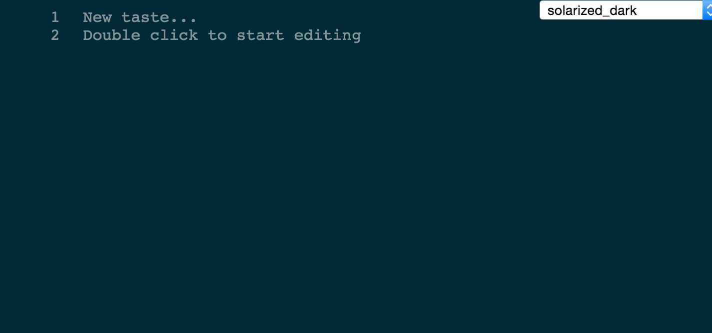
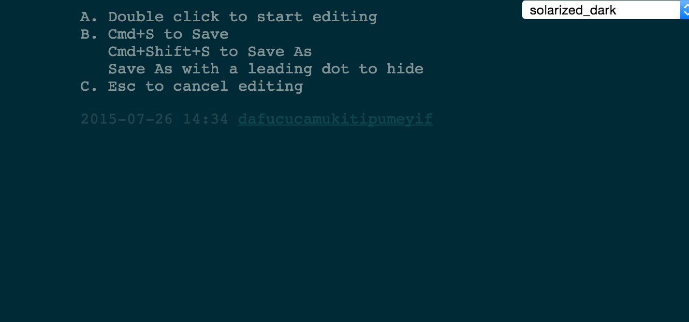

# Tastebin

A pastebin with taste i.e. minimalistic

For a *wiki* flavour of Tastebin, see https://github.com/andreineculau/tastetyper

* server: NodeJS, CoffeeScript, ExpressJS, ...
* client: HTML5, CoffeeScript, HighlightJs, ...







## Demo link

A friend of mine fired it up at http://tastebin.x-berg.de/ . Thanks, [Stefan](https://github.com/sstrigler)! :)


## Install and run

```sh
git clone git://github.com/andreineculau/tastebin.git
cd tastebin
npm install
# edit config.coffee as you see fit
npm start
```

Here's what you can configure out-of-the-box: [config.coffee](config.coffee).

In production, try

* [forever](https://github.com/foreverjs/forever)
* [upstarter](https://github.com/carlos8f/node-upstarter)
* ...

[](https://heroku.com/deploy?template=https://github.com/andreineculau/tastebin)


## Tested browsers

* Chrome 44
* Opera 30
* Safari 8
* Firefox 39


## Dependencies

* NodeJS
* *nix OS
* `git` in the $PATH
* GNU ls in the $PATH as `gnuls`, `gls` or `ls`


## Shell with curl/httpie

```sh
export TASTEBIN_URL="http://localhost:3000"
source tastebin.curl.sh # or tastebin.httpie.sh

# Save taste
echo "foo" | tastebin_save

# Save taste as...
echo "foo" | tastebin_save_as mynewtaste
```


## License

[Apache 2.0](LICENSE)
